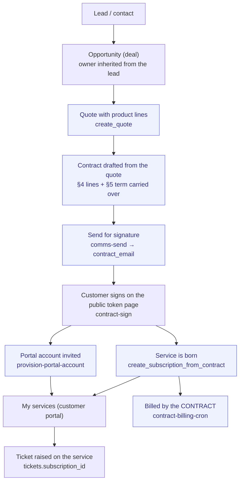

# Sign-to-Serve

> From signed agreement to a service the customer can see, pay for and get help
> with — the chain a telco, an ISP or any subscription service business runs on.

**Problem it solves:** A signed contract is usually where the system stops and
the spreadsheet starts — the customer has agreed to something they cannot see,
support has no idea what they hold, and the recurring fee is invoiced by memory.
This process turns the signature itself into the service record, the portal
login and the support entry point.

**Maturity level:** L3 — Operational (deal → quote → contract → sign → service →
portal → ticket works end to end)
**Status:** ✅ Core chain live · shipped 2026-08-07/08

## Flow

*🟦 = agent-runnable step*

## Participating modules & skills

| Step | Module | Skills / functions |
|---|---|---|
| Opportunity | crm / deals | `manage_deal` — owner inherited from the lead (see [Ownership & coverage](../architecture/ownership-and-coverage.md)) |
| Quote | quotes | `manage_quote`; accept-behavior dial decides the customer-facing language |
| Contract | contracts | `manage_contract`, `list_contract_templates`; the quote's agreed lines land in the agreement's §4, its term in §5 |
| Send | contracts + email | `send_contract_for_signature`, `comms-send` handler `contract_email` (fragment wrapped in the operator's branded shell, `expects_reply: true`) |
| Sign | contracts | `contract-sign` edge function — public token page, no login |
| Service | subscriptions | `create_subscription_from_contract` (idempotent, stamps `provider='contract'`) |
| Portal | account | `_shared/provision-portal-account.ts` → invite mail via `email-send` → `/account/activate` |
| Support | tickets | Ticket carries `subscription_id`, so support sees service + contract + SLA at once |
| Billing | contracts + invoicing | `contract-billing-cron` → `generate_contract_invoice` |

## How it works in practice

### The work story (telco shape)

A prospect asks for two fibre connections and a mobile plan. The salesperson
works the lead, the deal on it is theirs automatically, and the quote carries
the product lines and the price. When the customer says yes, the quote becomes a
contract: the agreed lines are written into §4 of the agreement and the
commitment term into §5 — nothing is retyped. "Send for signature" emails the
signing link (from the operator's own domain and mailbox, not the app origin),
and the customer signs on a public token page without any account.

The signature is the event that creates everything downstream: the service row
appears (what they hold, its term, its next invoice), a portal account is
created and invited so the customer can set a password on a locked-email page,
and from **My services** they can raise a ticket against that exact service.
Support opens the ticket and sees the service, the agreement it came from and
the SLA in one place.

### The one-invoicer rule

The decision with money in it, made structural. Two local billers exist:

| Biller | Bills | Marker |
|---|---|---|
| `contract-billing-cron` | contracts with `billing_enabled` | — |
| `subscription-billing-cron` | subscriptions where `provider = 'manual'` | filter in the cron |

A contract-born service is stamped `provider = 'contract'`, so the subscription
cron never picks it up — **the contract keeps billing and nothing double-bills.**
A guardrail (`src/lib/__tests__/service-chain.guardrails.test.ts`) fails if the
cron's filter ever widens or the birth function stops stamping `'contract'`.

### Idempotency & failure behaviour

- `create_subscription_from_contract` is idempotent: a unique index on
  `subscriptions(contract_id)` plus an existing-row return means a re-sign or a
  double fire cannot mint a second service.
- `contract-sign` logs but never throws on service/portal failure: a service
  that failed to appear is a follow-up, a signature that failed is a lost deal.
- The portal invite is idempotent too — an existing account is granted the
  `customer` role, never re-invited — and reports honestly when no email
  provider is configured (account exists, here is the link to pass on).

### The portal entrance

- Gated by `customer_portal.enabled`, **not** by `allowSelfSignup`: the operator
  initiated this by handing the customer a contract; they did not self-register.
- The invite link lands on `/account/activate`, where the email is read from the
  invite session and shown **read-only** — the customer only chooses a password.
  A signup form here would let them type any address and orphan the invited
  account that holds their service.
- No valid invite session → an honest "link expired" dead end, never a form.

### Two dials, not two products

The ecommerce module is more than a webshop — its catalog feeds quotes and
contracts — so a service business runs it with the storefront **off**:

| Setting | Hides |
|---|---|
| `store.storefront` | cart and storefront chrome |
| `customer_portal.enabled` | the public account entrance |

Both default true. A shop instance sees zero change from this process, and the
account header icon sends staff to `/admin` instead of dropping a salesperson
among order history and wishlists.

### Coming from spreadsheets

- The signed PDF in a folder → an agreement with a number (`AGR-…`), linked to
  the quote it came from
- The "vad har kunden?"-Excel → the service row the customer sees themselves
- The support call that starts with "vilket abonnemang gäller det?" → a ticket
  already bound to the service
- The reminder to invoice the retainer → the contract billing cron

## Agent coverage

| Actor | What they run |
|---|---|
| 👤 Manual | Drafting the agreement, pressing send, signing (customer) |
| 🤖 FlowPilot | Quote → contract drafting, sending for signature, billing crons, renewal checks |
| 🔗 External agent | Same over MCP (`manage_quote`, `manage_contract`, `send_contract_for_signature`, subscription skills) |

## Known gaps

- No `create_subscription_from_contract` MCP skill yet — the chain fires on
  signature; an agent cannot mint the service manually.
- Service **changes** (add a line mid-term) still go through the contract, not
  through `change_subscription` — proration applies to `provider='manual'` rows.
- Portal shows services and tickets; no self-service upgrade/termination.
- Cancellation of a contract does not yet close the service row automatically.

## Related

- [Quote-to-Cash](./quote-to-cash.md) — the invoicing half
- [Subscribe-to-Renew](./subscribe-to-renew.md) — the recurring-revenue loop
- [Support-to-Resolution](./support-to-resolution.md) — what happens after the ticket
